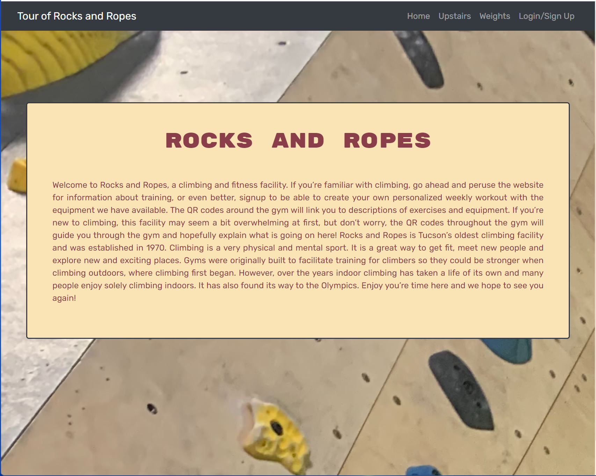
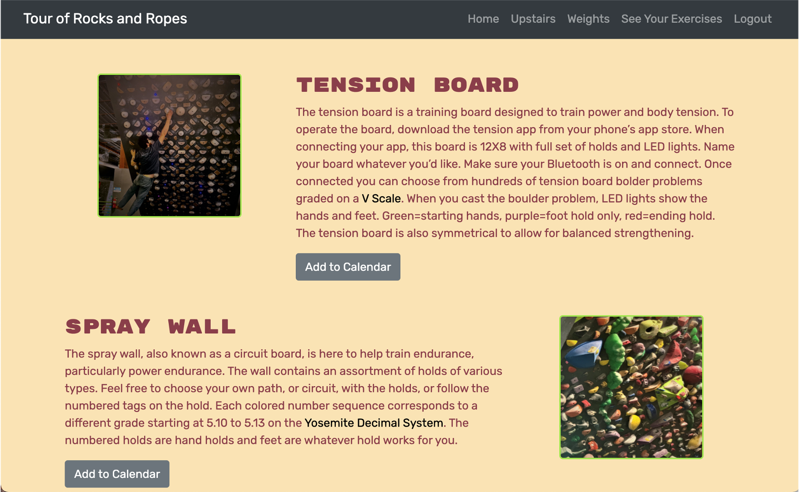
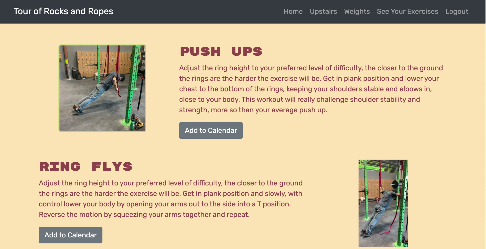
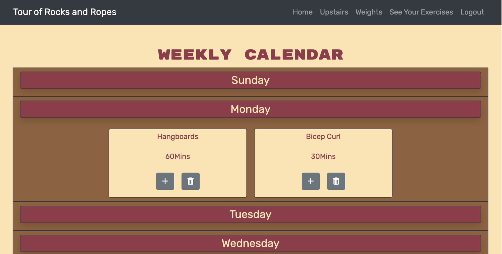
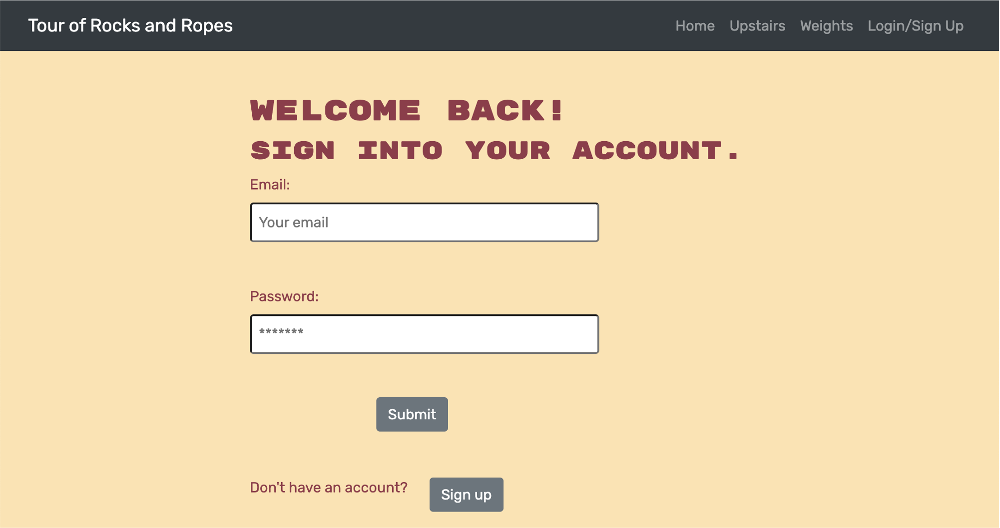
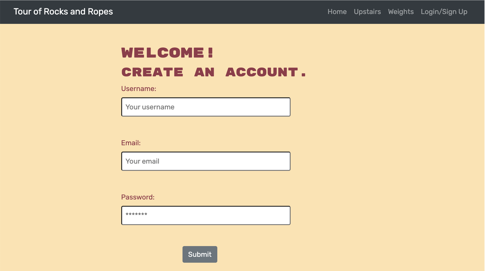

# Rocks and Ropes

 

# Description
Rocks and Ropes is an application designed to help rock gym members and visitors train, workout, and navigate the rock gym.

## Table of Contents
  * [Technologies](#technologies)
  * [Preview](#preview)
  * [Usage](#usage)
  * [Link](#link)
  * [Credits](#credits)

## Technologies used
- Node.js
- Express.js
- MongoDB
- Mongoose
- GraphQL
- Apollo
- JWT
- React
- React Router
- Bootstrap

## Preview
Below are several screenshots of the Rocks and Ropes application:
 
 
 
 
 
 

## Usage
Follow the steps below to navigate and use the Rocks and Ropes application:
1. Visit the application by following the link provided below in the Link section.
2. Once you visit the link, you will be presented with the homepage of the application, which contains an image of the gym and a description of the application.
3. At the top of the page, there is a navigation bar that contains nav links to Home, Upstairs, Weights, Login/Sign-Up.
4. If you want to peruse the site, you can visit the Upstairs and Weights pages to view the different areas of the gym which contain images and descriptions of how to use and workout with the gym equipment.
5. The Upstairs page contains some of the larger and more complex climbing equipment such as the tension board and spray wall. Each piece of equipment has an image and description of how to properly use it.
6. The Weights page then has three more links (Free Weights, Rings, and TRX Bands), and by clicking on each of these links you will be taken to the different pages associated with each type of equipment.
7. Similar to the Upstairs page, each category of weights will contain an image and description for each piece and type of equipment. 
8. If you want to experience the full capabilities of the Rocks and Ropes application, you are going to want to sign up and create an account.
9. To sign up, follow the link in the navigation bar which will take you to the login page where you can click a button to be taken to the sign up page if you do not already have an account.
10. Once clicking on the sign up page, you will create a username, enter your email, and then enter a password. Make sure you follow the requirements for username and password length as well as enter a valid email.
11. Once you have created an account, you will now have the ability to add exercises to your own personalized weekly calendar. 
12. To add exercises, you can visit any of the Weights pages or the Upstairs page, and there will now be a button to Add to Calendar.
13. Once you click the Add to Calendar button you will be presented with a modal, which will contain the name of the exercise, and then you will have the ability to add the day, length of workout, sets, and reps, as well as a note for the exercise you add.
14. Once you hit save, the activity will be added to your weekly calendar, which you can view by visiting the See Your Exercises navigation link.
15. This link will take you to your weekly calendar which has all of the days of the week, and then under each day it will have any exercises you have added for that day's workout.
16. If you made a mistake and need to either edit or delete the exercise you added, you will have the ability to do so by clicking on the trash can to delete the exercise, or the "+" symbol to pull up a modal with the option to edit your exercise.
17. Clicking the edit button will take you to a new modal where you can edit the day, length, reps, sets, and notes for the exercise you added. Make sure you hit the save changes button to finalize the edit.
18. You can also click on the More Information button in the exercise modal to be taken to the page that contains that exercise's image and description if you need assistance on how to perform the exercise. 
19. Once you have completed your weekly calendar you can continue to refer to it for your weekly rock gym workouts, and each week you can either start fresh by create a new workout routine or continue to use your workout routine from the prior week. 
20. After using the application you can choose to logout when you are finished with all of your exploring and workout creating. 

## Link
Click on the link below to visit the Rocks and Ropes Application:

## Credits
[Elle Knapp](https://github.com/dmknapp2385)  
[Miranda Lane](https://github.com/MirandaL27)  
[Sammi Moore](https://github.com/sm3131)  
[Michael Walker](https://github.com/michaelwwalker42) 
